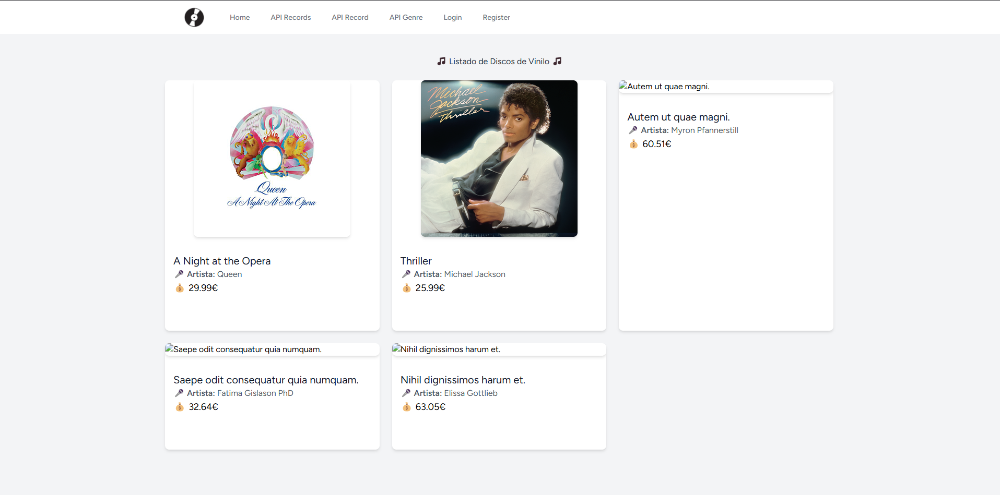
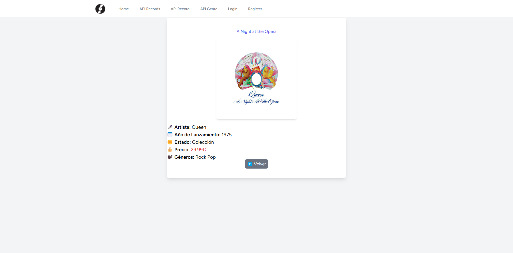
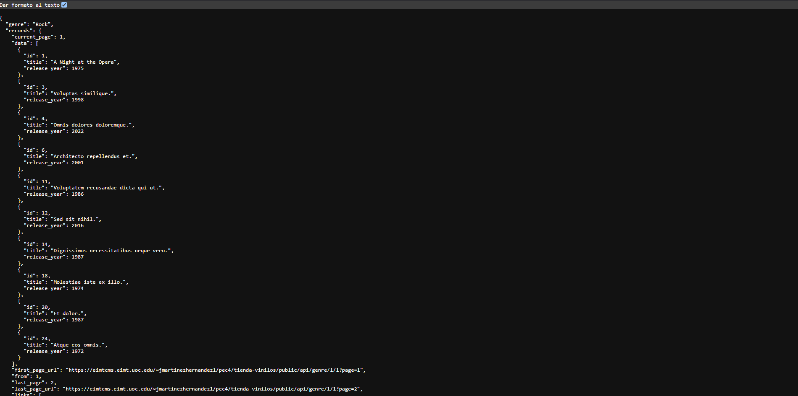
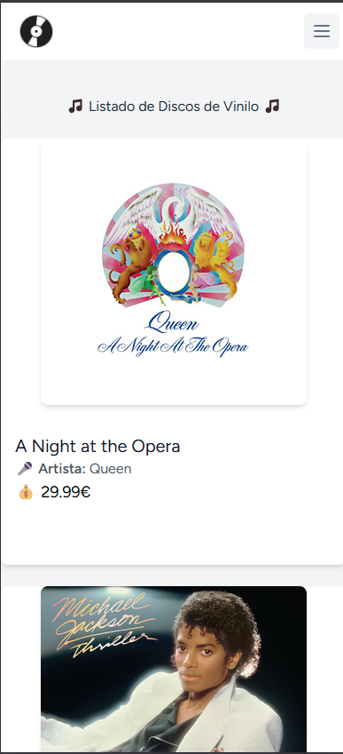

<p align="center"><a href="https://laravel.com" target="_blank"></a></p>

# Tienda de Vinilos 🎵

Un proyecto en Laravel de un backend de un sitio web con autenticación y endpoints de API de consulta básica.

## 🚀 Características
- Listado de discos con imágenes
- Filtrado por género musical
- API REST para acceso a los datos
- Sistema de autenticación con Laravel Breeze

## 📦 Instalación
1. Clona el repositorio:
   ```
   git clone https://github.com/TU_USUARIO/tienda-vinilos-laravel.git
   ```
2. Instala dependencias: `composer install`

3. Crear y configurar el archivo .env: `cp .env.example .env`

4. Generar clave de aplicación: `php artisan key:generate`

5. Ejecutar migraciones y seeders: `php artisan migrate --seed`

6. Levantar servidor: `php artisan serve`

## 🛠 Tecnologías

- Laravel 11
- PHP 8.x
- MySQL
- Tailwind CSS

## 📸 Capturas de Pantalla

PC:




Móvil:


---
📢 **¡Cualquier sugerencia es bienvenida!**  
💻 **Desarrollado por:** [Jesús Martínez Hernández](https://github.com/j-marthe)
```
